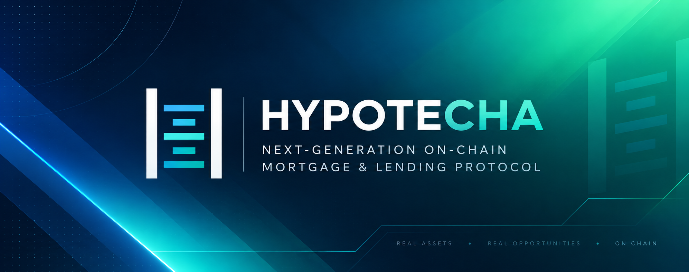

<div align="center">
  
</div>

# HYPOTECHA

> **On-chain encumbrance enforcement for tokenized assets — double-pledging is structurally impossible.**

Hypotheca is a permissionless enforcement layer on top of [Hedera Asset Tokenization Studio (ATS)](https://docs.hedera.com/hedera/open-source-solutions/asset-tokenization-studio-ats) that records partial claims/collateral against an asset's available balance and **enforces** them on-chain. Every credit line a bank draws against a tokenized asset is materialized as an ATS **hold locked inside an on-chain vault** — so the same unit can never back two loans, and over-pledging is rejected by the contract, not by an API.

Built for the ETHGlobal Hedera Bounty **"Tokenization of Anything"**.

<p align="center">
  
  
  
  
  
  
  
  
  
</p>

### At a glance

<div align="center">

<table>
  <tr>
    <th>Enforcement</th>
    <th>Pricing</th>
    <th>Stack</th>
  </tr>
  <tr>
    <td>Every pledge is an <b>ATS hold</b> locked inside the on-chain vault</td>
    <td>Coverage &amp; health on <b>live Chainlink USD</b> feeds</td>
    <td><b>No backend</b> — reads/writes directly from any EVM wallet</td>
  </tr>
  <tr>
    <td><b>2 live platforms</b> on chain 296 (SUKUK · GOLD)</td>
    <td><b>29 unit tests</b> · <b>0 open audit findings</b></td>
    <td>Programmatic <b>Remotion</b> demo-video workspace in <code>apps/video</code></td>
  </tr>
</table>

</div>

---

## Table of contents

1. [Highlights](#highlights)
2. [The problem](#the-problem)
3. [The vault model](#the-vault-model)
4. [System architecture](#system-architecture)
5. [Contract surface](#contract-surface)
6. [Live deployment (Hedera testnet)](#live-deployment-hedera-testnet)
7. [Repository layout](#repository-layout)
8. [Technology stack](#technology-stack)
9. [Getting started](#getting-started)
10. [Script commands](#script-commands)
11. [Frontend application](#frontend-application)
12. [Production deployment](#production-deployment)
13. [Security & testing](#security--testing)
14. [Known limitations](#known-limitations)
15. [Hedera ATS integration notes](#hedera-ats-integration-notes)

---

## Highlights

- **No backend, no SDK services.** The dashboard talks to the contracts **directly** through [viem](https://viem.sh) + [wagmi](https://wagmi.sh) from any EVM wallet — first-class Hedera citizen plus MetaMask/Brave/Flow support.
- **Vault-token truth.** Free (encumberable) collateral is the vault's raw `balanceOf`; ATS holds already deduct locked units, so there is **no double counting** between the registry and the on-chain balance.
- **Real prices.** Coverage, health factor, live previews, and the dashboard ticker all run on **live Chainlink price feeds** (7 pairs, Hedera testnet).
- **Structurally enforced.** `InsufficientCollateral`, `CoverageBelowThreshold`, and `PositionAlreadyOpen` are Solidity reverts — a user who bypasses the UI still hits the same guard.
- **Creditors actually recover collateral.** On liquidation (`settle`), every hold is executed to its creditor's account on-chain and verifiable on HashScan.
- **29 passing unit tests** and a zero-open-finding [audit report](docs/AUDIT.md); one `npm run audit` gate runs the full pipeline.

---

## The problem

In tokenized finance the risk is rarely "who owns the token" — it is **what is already pledged against it**. The same $1M token can be silently financed twice: once with Bank A and again with Bank B, while both believe they hold first-priority collateral.

Without a single, queryable, and enforceable source of truth, double-pledging becomes a systemic risk across repo markets, trade finance, and securities lending.

## The vault model

HYPOTECHA's core primitive is the **EncumbranceLedger** contract, which acts as the on-chain *vault* (token holder) for each platform asset:

1. The asset's beneficiary transfers its **full balance** into the vault and credits itself via `deposit`.
2. A bank draws a credit line: `requestLoan(platformId, creditor, units)`.
3. Each draw **materializes as an ATS hold locked inside the vault**: `createHoldByPartition(partition1, { amount, expiration, escrow: this, to: zero })`. ATS holds deduct the locked units from the vault's `balanceOf`, so one unit can never back two draws.
4. A **coverage gate** runs on every draw using the live Chainlink price: `collateral USD / outstanding USD` (with platform interest marked up into each drawn unit) must stay above the platform threshold.
5. `repay` runs `releaseHoldByPartition` — the release-back primitive that carries **no recipient identity check** — restoring the units to the vault.
6. `settle` is **permissionless**: when coverage drops below threshold or the platform matures with open positions, every hold is executed (`executeHoldByPartition`) into its creditor's address. Positions freeze, collateral moves.
7. `withdraw` returns free units to a depositor via a **create-then-execute transient hold** — one of the only whitelisted transfer primitives available on the deployed ATS diamonds.

Because the vault physically holds the tokens and ATS holds physically lock them, **available balance is an on-chain fact**, not an API estimate.

---

## System architecture

```text
                ┌─────────────────────────────────────────────────────────────┐
                │                         DASHBOARD (React)                   │
                │         wagmi/viem · any EVM wallet · reads + writes        │
                │   Live ticker (7 Chainlink pairs) · per-asset deposit bar   │
                │   Pledge w/ live preview · rejection modal · event log      │
                └──────────────────────┬──────────────────────────────────────┘
                                      │ RPC (https://testnet.hashio.io/api)
                        ┌─────────────▼─────────────┐   ┌──────────────────────┐
                        │  EncumbranceLedger (vault)│   │   RegistryAnchor     │
                        │  deployed 0xfa01…6958     │   │  deployed 0x12E9…0754 │
                        │  positions · deposits     │<──│  asset registry /     │
                        │  coverage · health        │   │  instance enumeration │
                        └──────┬────────────┬───────┘   └──────────────────────┘
                               │            │
                  ┌────────────▼─────┐  ┌───▼─────────────────────┐
                  │  ATS diamond (   │  │  Chainlink aggregator   │
                  │  token holder)   │  │  e.g. USDC/USD 0xb632…  │
                  │  createHoldBy     │  │  latestRoundData 8 dec  │
                  │  executeHoldBy    │  └─────────────────────────┘
                  │  releaseHoldBy    │
                  └──────────────────┘
                               │
                 ┌─────────────▼──────────────────────────────────┐
                 │   Mirror node (event source) — hashio eth_getLogs│
                 │   is NOT supported, so history is read from the │
                 │   Hedera mirror node REST API                    │
                 └──────────────────────────────────────────────────┘
```

**Data flow for a pledge:**

```
Wallet → simulateContract(requestLoan) → on-chain revert decoded & previewed in the UI
      → writeContract(requestLoan) → ATS createHoldByPartition locks units in the vault
      → EncumbranceCreated event → polled by the dashboard (15 s) via the mirror node
```

---

## Contract surface

### EncumbranceLedger — `packages/contracts/contracts/EncumbranceLedger.sol`

Non-upgradeable, `owner`-controlled configuration, non-reentrant critical sections, no ERC-7201 namespacing needed (single immutable contract).

| Function | Access | Description |
|---|---|---|
| `configurePlatform(platformId, token, feed, tokenDecimals, coverageThresholdBps, interestBps, borrowCapUnits, maturityTs)` | owner | Registers a platform; reads aggregator decimals at configure time. `maturityTs = 0` ⇒ 180-day hold grace at borrow time. |
| `setStaleAfter(sec)` / `setPlatformDefaultGrace(platformId, graceSec)` | owner | Staleness window / per-platform hold grace. |
| `deposit(platformId, depositor, units)` | depositor / owner | Bookkeeping attribution; the token transfer into the vault must already exist. |
| `requestLoan(platformId, creditor, units)` | anyone | Draws credit: creates an escrow hold (escrow = vault), marks up the unit by `interestBps`, enforces cap + coverage gate. |
| `repay(platformId, creditor)` | anyone | Releases the creditor's hold back into the vault. |
| `settle(platformId)` | anyone | Permissionless liquidation + maturity auto-default; executes each hold to its creditor. |
| `withdraw(platformId, units)` | depositor | Returns free units via a create-then-execute transient hold. |

**Key views:** `vaultBalanceUnits`, `availableUnits`, `totalEncumbered`, `totalDeposited`, `unitUsd18Of`, `collateralUsd18Of`, `outstandingUsd18Of`, `coverageBpsOf`, `healthFactor18Of`, `positions`, `creditorsOf`.

**Guard mechanics:**

- `availableUnits = vault balanceOf(token)` — ATS holds already remove the locked amount on-chain.
- Coverage per draw: `(free + locked) × unitUsd18 vs. outstanding + units × unitUsdMarked` — reverts `CoverageBelowThreshold` below the platform's `coverageThresholdBps`.
- `MAX_BORROWERS_PER_PLATFORM = 32`, `MAX_THRESHOLD_BPS = 20_000`.

**Errors (decoded in the frontend):** `InsufficientCollateral`, `CoverageBelowThreshold`, `PositionAlreadyOpen`, `PositionNotFound`, `PlatformNotConfigured`, `PlatformNotActive`, `PlatformLiquidatedError`, `NotDepositor`, `TooManyBorrowers`, `PriceNotPositive`, `StalePrice`, `AtsNotAllowed`, `OnlyOwner`, `ZeroAddress`, `ZeroValue`, `ReentrantCall`.

### RegistryAnchor — `packages/contracts/contracts/RegistryAnchor.sol`

Enumerable asset registry: `registerInstance`, `updateFaceValue`, `unregister`, `getInstance(s)`, topic control. Entry-point for the dashboard's asset list; an instance without a live `configurePlatform` is skipped client-side.

---

## Live deployment (Hedera testnet)

**Network:** chain `296` · RPC `https://testnet.hashio.io/api` · explorer `https://hashscan.io/testnet`

| Contract | Address |
|---|---|
| EncumbranceLedger | `0xfa01E5b4F2765F33790e8d89A8620bdFd3a16958` |
| RegistryAnchor | `0x12E99d5F169eB3b34aabFb2936619febe7da0754` |
| USDC/USD Chainlink feed | `0xb632a7e7e02d76c0Ce99d9C62c7a2d1B5F92B6B5` |

Source of truth: `packages/deployments/testnet.json`.

### Platforms

`platformId` is the ASCII code of the symbol in a `bytes32` (e.g. `0x…73756b756b` = `"sukuk"`).

| Symbol | PlatformId (suffix) | Asset EVM | Face | Deposited | Encumbered | Vault | Status |
|---|---|---|---|---|---|---|---|
| **SUKUK** | `…73756b756b` | `0xb493…13c3` | 1,000,000 | 340,000 | 100,000 | 240,000 | **LIVE** |
| **GOLD** | `…676f6c64` | `0x63d8…b798` | 500,000 | 300,000 | 0 | 300,000 | **LIVE** |
| BETA | `…62657461` | `0xf687…ac159` | 1,200,000 | 0 | 0 | 0 | Hidden (stuck hold) |
| GREEN | `…7265656e` | `0xd394…3e256` | 800,000 | 0 | 0 | 0 | Hidden (stuck hold) |
| ALPHA | `…616c706861` | `0x8f13…6e1c` | 1,000,000 | — | — | — | Anchor-only, unconfigured |

SUKUK platform config on-ledger: coverage threshold **10,000 bps (100%)**, interest **200 bps (2%)**, borrow cap **1,000,000 units**, maturity `1824940800` → 0-day grace.

Live E2E state (see `docs/AUDIT.md`): SUKUK deposits 340,000 · encumbered 100,000 (Bank B) · vault 240,000 · coverage ≈ 333% (health 3.3×); GOLD vault 300,000.

---

## Repository layout

```text
HYPOTECHA/
├── apps/
│   ├── video/                     # Remotion programmatic demo video (npm run dev / npm run render)
│   └── web/                       # React + Vite dashboard (reads & writes the ledger)
│       ├── src/lib/               # ledger.ts (ABI + reads/writes) · chainlink.ts · hypotheca.ts
│       ├── src/components/        # EncumbranceBar · ChainlinkTicker · RejectionModal · …
│       ├── src/pages/             # Landing · Dashboard · Assets · Claims · CreateClaim · History
│       └── public/                # brand + media assets
├── packages/
│   ├── contracts/                 # Solidity + Hardhat
│   │   ├── contracts/             # EncumbranceLedger.sol · RegistryAnchor.sol · mocks/
│   │   ├── scripts/               # deploy/fund/verify/e2e/spike scripts
│   │   └── test/                  # 29 unit tests (ledger + anchor)
│   └── deployments/               # testnet.json — live addresses, chain 296
├── docs/
│   └── AUDIT.md                   # full bug & error audit (0 open findings)
├── .env.example
├── package.json                   # npm workspaces + root scripts (incl. `npm run audit`)
└── README.md
```

---

## Technology stack

| Layer | Choice |
|---|---|
| Contracts | Solidity `0.8.24` (viaIR optimizer) · Hardhat `^2.22` · dotenv · `@hashgraph/asset-tokenization-sdk` |
| Frontend | React `^19` · Vite `^8` · TypeScript `~6.0` · TailwindCSS v4 · framer-motion · lucide-react |
| Web3 | viem `^2.56` · wagmi `^3.7` · @tanstack/react-query `^5` |
| Linting | oxlint |
| Wallet | wagmi connectors (`metaMask`, `injected`) on Hedera testnet chain 296 |

---

## Getting started

**Prerequisites**

- Node.js **20 LTS or 22 LTS** (Hardhat prints an unsupported-warning on Node 25 — fine for reads, avoid for deployments).
- npm 10+.

```bash
git clone <repo-url>
cd HYPOTECHA
npm install
cp .env.example .env   # only the contracts scripts read this
```

`.env` keys used by the contract scripts:

| Variable | Required | Used by |
|---|---|---|
| `PRIVATE_KEY` | yes | all signing (deploy, fund, verify, e2e) |
| `HEDERA_TESTNET_RPC_URL` | no (defaults to testnet.hashio.io/api) | all |
| `EVM_ADDRESS` | script-specific | deploy-new-assets, setup-anchor, make-topic |
| `ACCOUNT_ID` | script-specific | make-topic |
| `MIRROR_NODE_URL` | no (has default) | mirror reads |

> The web app needs **no environment variables** — contract addresses, the RPC endpoint, and the Chainlink feeds are committed constants in `apps/web/src/lib/ledger.ts` and `chainlink.ts`.

---

## Script commands

Run from the repository root.

| Command | What it does |
|---|---|
| `npm run dev:web` | Vite dev server at `http://localhost:5173` |
| `npm run build:web` | `tsc -b && vite build` |
| `npm run build:contracts` | `hardhat compile` |
| `npm run test:contracts` | `hardhat test` (29 tests) |
| `npm run deploy:testnet` | `hardhat run scripts/deploy.ts` (anchor only) |
| `npm run audit` | tests → contract typecheck → web lint → web build (CI gate) |

Targeted network scripts live in `packages/contracts/scripts/` — run with

```bash
npm --workspace @hypotheca/contracts run build
npx --prefix packages/contracts hardhat run scripts/<name>.ts --network hederaTestnet
```

| Script | Purpose |
|---|---|
| `deploy-ledger.ts` | Deploys EncumbranceLedger + RegistryAnchor, writes `packages/deployments/testnet.json` |
| `setup-anchor.ts` | Populates the anchor with ATS instances |
| `fund-multi.ts` | Funds platform vaults: configure → self-escrow hold → execute to ledger → `deposit` |
| `verify-ledger.ts` / `verify-multi.ts` | Reads back platform/vault state from the live ledger (per-platform status report) |
| `e2e-ledger.ts` | Full live testnet E2E: pledge → over-pledge reject → repay → withdraw → settle |
| `spike-vault.ts` / `spike-ats.ts` | On-Chain capability probes for ATS diamonds (transfer/hold/identity primitives) |

> All ledger writes use an explicit `gasLimit = 800_000n` because HashIO underestimates gas for multi-hop calls; token-facet calls use `3,000,000n`. No gas-price override.

---

## Frontend application

**Flow:** Landing → **Launch App** → boot sequence → wallet gate → dashboard. Any EVM wallet on chain 296 works (Hedera Flow/COPE, MetaMask, Brave).

| Page | Capabilities |
|---|---|
| **Dashboard** | KPI cards · live **Chainlink ticker** (7 pairs, marquee) · per-asset EncumbranceBar with **live USD price chip** · claims table · terminal-style event log |
| **Assets** | Asset cards with utilization bars, live ledger metrics, price, and health |
| **New Claim** | Asset selector · live availability bar · **live preview** (what the pledge will do) · on-chain rejection modal with decoded revert (`InsufficientCollateral`, `CoverageBelowThreshold`, `PositionAlreadyOpen`) · success banner with transaction hash |
| **Claims** | Per-asset active/released claims with **per-claim release** (broadcasts a real `repay` tx) |
| **History** | Mirror-node event log (`VAULT_DEPOSITED`, `VAULT_WITHDRAWN`, `HOLD_CREATED`, `HOLD_RELEASED`, `PLATFORM_LIQUIDATED`) |

**Reactively fresh:** every 15 s the overview, claims, and events re-poll the ledger; the Chainlink ticker polls every 15 s by default. There is no local persistence — the chain is the state.

**Client-side messaging:** a pledge is *simulated* first; the resulting revert is decoded and surfaced as a polished rejection modal *before* any broadcast — while a straight RPC caller still hits the identical on-chain revert.

---

## Production deployment

The app is static (no backend). Deploy with any static host — e.g. Vercel:

1. Import the repo; set **Root Directory** to `apps/web` (monorepo auto-detected).
2. Build command `npm run build` → output `dist/` (Vite).
3. **No environment variables required.**

> HashScan contract verification is manual upload (Sourcify auto-verify is broken for chain 296 — it returns HTML; see `docs/AUDIT.md`).

---

## Security & testing

- **Reentrancy:** the only external calls make use of `nonReentrant` guards; CEI ordering is used across `requestLoan`, `withdraw`, `repay`, `settle`.
- **Coverage:** 29 unit tests across both contracts, including boundary over-pledge, coverage breach, feed crash → liquidation, maturity auto-default, stale/non-positive price reverts, withdrawn/attributed balances, and access-control tests.
- **Audit:** `npm run audit` runs the whole gate; full findings (including the legacy-diamond quirks and their resolutions) are in [docs/AUDIT.md](docs/AUDIT.md) — **0 open High/Medium/Low**.
- **Reduced trust surface:** no API to DDoS, no keys in the client, no private state — all reads are public contract views.

---

## Known limitations

1. **Sourcify auto-verify broken for chain 296** — server returns HTML; manual HashScan upload required.
2. **HashIO underestimates gas for multi-hop calls** — explicit `gasLimit=800_000n` passed on all writes.
3. **HashIO does not support `eth_getLogs`** — event history is sourced from the mirror-node REST API.
4. **Legacy anchor diamonds carry stuck holds** — ALPHA/BETA/GREEN holds whose escrow predates the ledger cannot be executed/released by it (ATS enforces escrow-only `execute`/`release` and no transfer facets are registered); recovering them needs the ATS issuer key or a ledger-side escrow method. Testnet-only deadweight, hidden from the UI by a funded-only filter.
5. **Vault funding primitive is a self-escrow hold + execute-to-ledger** — because ATS transfer facets are unregistered, funding runs `createHoldByPartition(escrow = beneficiary, to = vault)` then the beneficiary (as escrow) executes into the vault, then `ledger.deposit`. Live-verified by `fund-multi.ts`.
6. **No persistent frontend state** — all reads refresh on a 15-second poll.
7. **No real-time WebSocket events** — mirror-node `wss://` is not used.

---

## Hedera ATS integration notes

- Holds deduct from `balanceOf` on-chain — this is what makes the vault model self-consistency: **available = vault balance**.
- The ledger is an **external caller** of the ATS diamond — no facet is registered on it. It only ever uses the hold primitives (`createHoldByPartition`, `executeHoldByPartition`, `releaseHoldByPartition`).
- `releaseHoldByPartition` carries **no recipient identity check**; `executeHoldByPartition` gates the recipient for identified parties — which is exactly the asymmetry HYPOTECHA relies on: releases return to the vault, executions deliver into a creditor's account.
- ATS `mint` is issuer-restricted (`AccountIsNotIssuer` for the signer), which is why new platform funding flows through holds, never through minting.

---

*HYPOTECHA — enforcement-first collateralization for tokenized assets. Audit lineage in [`docs/AUDIT.md`](docs/AUDIT.md); live on Hedera testnet chain 296.*